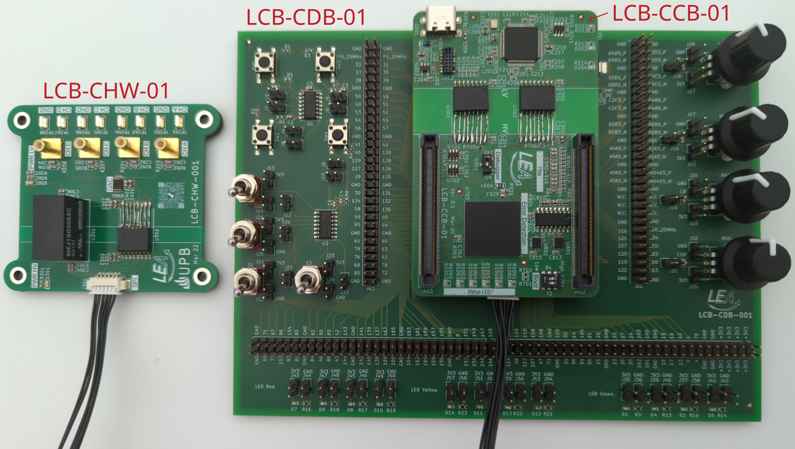
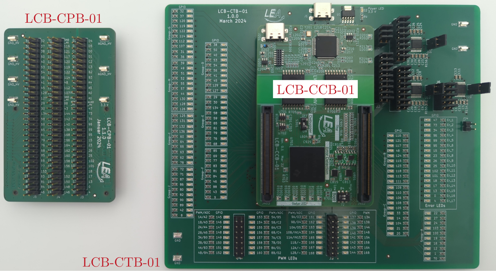
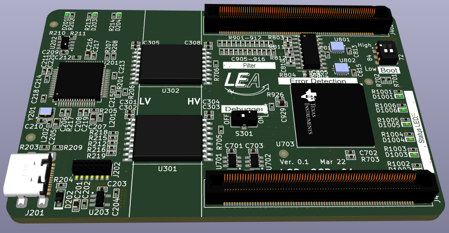

# LEA Control Board

    

The LEA Control Board (LCB) is a construction kit to provide power electronic converters with a control board.

The basic module is the control board (LCB-CCB) itself. It contains a powerful dual-core processor, error latches and various predefined low-pass filters to respond to input signals. An XDS100v2 debugger is directly integrated on the board. 

The docking board (LCB-CDB) is suitable for initial operation. This contains various input options (switches, buttons, potentiometers) as well as LEDs for output.

The external hardware monitor (LCB-CHW) is for viewing internal counter variables on the oscilloscope and is mainly used for troubleshooting the control board in the overall system (control board + power converter).

    

The pin board (LCB-CPB) is for in-circuit signal measurments by an external scope on certain pins.
The test board (LCB-CTB) was developed to check all pins, PWM signals, ADCs and DACs for functionality after a new board has been completed (end of line test).

## PCB overview
This is the main repository of the LEA Control Board (LCB) project. Due to correct PCB versioning, every single PCB is in its own repository.
 * [LCB-CDB-01_Dock_Board](https://github.com/upb-lea/LCB-CDB-01_Dock_Board)
 * [LCB-CHW-01_Hardware_Monitor](https://github.com/upb-lea/LCB-CHW-01_Hardware_Monitor)
 * [LCB-ADA-01_Adapter_Board](https://github.com/upb-lea/LCB-ADA-01_Adapter_Board)
 * [LCB-CPB-01_Pin_Board](https://github.com/upb-lea/LCB-CPB-01_Pin_Board)
 * [LCB-CTB-01_Test_Board](https://github.com/upb-lea/LCB-CTB-01_Test_Board)
 * [LCB-CBB-01_Bus_Board](https://github.com/upb-lea/LCB-CBB-01_Bus_Board)

Symbols, footprints and 3D-models can be found in the [LEA KiCad Library](https://github.com/upb-lea/LEA_KiCad_Library).

Due initially wrong selected comparators (no rail-to-rail), the comparator adapter board [LCB-ADA-01](https://github.com/upb-lea/LCB-ADA-01_Adapter_Board) was introduced to replace the comparator.

## PCB versioning
Example `LCB-CCB-01-1.0.5`:
 * First three letters `LCB`: Parent project name `LEA Control Board`
 * Second three letters `CCB`: PCB name `Control Board`
 * Number `01`: PCB size. For future use in case of several PCB sizes
 * First version number `1`: Major version, increases for incompatible changes
 * Second number `0`: PCB release, increases for improved layouts
 * Third number `5`: Schematic version, increases for component changes, but no layout changes


## Kicad Options
To open the LEA Control Board files, [KiCad 8](https://www.kicad.org/) needs to be used. Make sure that you run the latest version of KiCad.

### Downloading this project and folder structure
To use this project, LEA KiCad symbols, footprints and 3D-models need to be included. Note, that both folders need to be in the same direction.

Clone the symbols, footprints and 3D-models:
```
git clone https://github.com/upb-lea/LEA_KiCad_Library.git
```

Clone this project:
```
https://github.com/upb-lea/LCB-CCB-01_LEA_Control_Board.git
```
If you are downloading the `.zip`-files manually, unpack them in the same direction.

### Symbol library and footprint libary
The libraries are included by default, if the above mentioned folder structure was considered. Open Kicad, load one of the projects and see the libraries:
 * `symbol editor` -> Search for `LEA_Symbol_Library`
 * `footprint editor` -> Search for `LEA_Footprint_Library`

### Set environment variable for 3D models:

Please refer to [this section](https://github.com/upb-lea/LEA_KiCad_Library#set-environment-variable-for-3d-models).

## Software
Various software examples using the LEA Control Board is available and can be found [in this repository](https://github.com/upb-lea/LCB-Software). There are examples for using the hardware monitor, SPI, UART and many others.

## How to design the LCB into your cirucit?
 * A stable external 3.3 V power supply must be provided, recommended by a linear regulator.
 * It is recommended to use buffer-ICs for the LCB GPIOs to prevent damage on the LCB board.

## Design decisions 
 * To not confuse the user, there is only one supply voltage needed. All pins of the board are save for 3.3 V. 
 * A stable external 3.3 V power supply must be provided, recommended by a linear regulator. We did not decide for an internal regulator, as this regulator does not know your external load, and might be overloaded.
 
