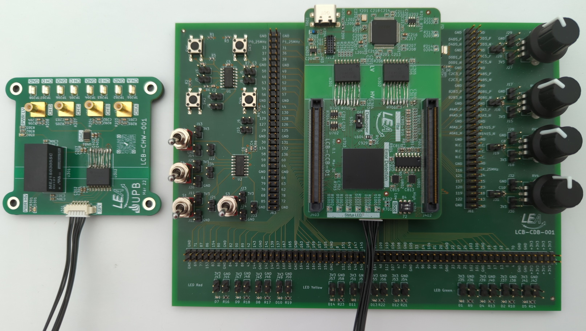
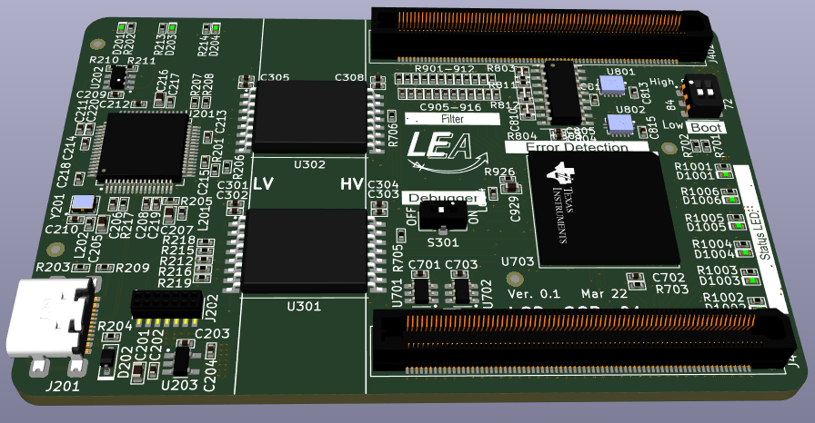
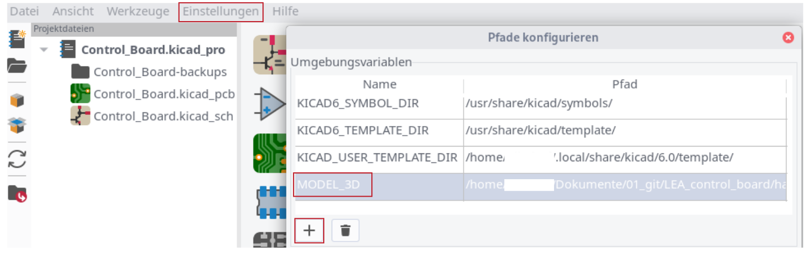

# LEA_control_board

    

The LEA-Control-Board (LCB) is a construction kit to provide power electronic converters with a control board.

The basic module is the control board itself. It contains a powerful dual-core processor, error latches and various predefined low-pass filters to respond to input signals. An XDS100v2 debugger is directly integrated on the board. 

The docking board is suitable for initial operation. This contains various input options (switches, buttons, potentiometers) as well as LEDs for output.

The external hardware monitor is for viewing internal counter variables on the oscilloscope and is mainly used for troubleshooting the control board in the overall system (control board + power converter).

## Kicad Options
### Symbol library and footprint libary
The libraries are included by default. Open Kicad, load one of the projects and see the libraries:
 * `symbol editor` -> Search for `LEA_SymbolLibrary`
 * `footprint editor` -> Search for `LEA_FootprintLibrary`

### Set environment variable for 3D models:

In the main menu, first select "Preferences" and then "Configure Path".
Replace the environment variable `MODEL_3D` with the current location of the 3D-models, e.g. `/path/LEA_control_board/hardware/KiCad_Library/Footprint_Library/3D_Model`. 

Note: if you are using KiCAD6, and there is a variable `KICAD6_3DMODEL_DIR`, ignore this variable and add `MODEL_3D` as mentioned above.

# Software
## Flash XDS100 Firmware to FTDI Chip:
 * Watch this [video](https://www.youtube.com/watch?v=vZaF5ckf3OQ) first
 * Download FT Prog [here](https://ftdichip.com/utilities/)
 * Load the configuration file for XDS100v2 programmer: `File` -> `Open template` -> [Modified template](/software/01_Control_boards/XDS100v2_UART.xml)
 * Right click on `Device: 0` -> right click -> `Apply Template` -> `Template: XDS100v2_UART.xml`
 * Flash file: `Programm Devices` -> `Program`
 
Note: 
It is very important to click on "Apply Template" as shown in the video. Otherwise the controller will not be programmed correctly!

Note: 
The modified file has the `Virtual COM Port` enabled to provide UART communication. This is not implemented as in the video. To enable this, see the figure. 

## Code Composer Studio: Import software project and adapt it to your computer filepaths
 * `Project` -> `Import CCS Projects...` -> Choose your project to import
 * In `Select search-directory` browse to your project (e.g. `.../LEA_control_board/software/01_Control_boards/F28386D_GPIO/`
 * Press `Finish`
 

# Manufacturing the LCB
 * Minimum PCB thickness is 2.3 mm due to the position-pin overlapping of J501/402 and J502/J403.
 * For automated placement, the position pin holes of the connectors J501/402/J502/J403 should be milled with a depth of minimum 1.3 mm. 
 

