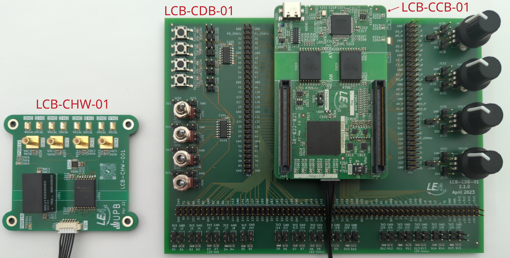

# LEA_control_board

    

The LEA-Control-Board (LCB) is a construction kit to provide power electronic converters with a control board.

The basic module is the control board itself. It contains a powerful dual-core processor, error latches and various predefined low-pass filters to respond to input signals. An XDS100v2 debugger is directly integrated on the board. 

The docking board is suitable for initial operation. This contains various input options (switches, buttons, potentiometers) as well as LEDs for output.

The external hardware monitor is for viewing internal counter variables on the oscilloscope and is mainly used for troubleshooting the control board in the overall system (control board + power converter).

## PCB versioning
Example `LCB-CCB-01-1.0.5`:
 * First three letters `LCB`: Parent project name `LEA Control Board`
 * Second three letters `CCB`: PCB name `Control Board`
 * Number `01`: PCB size. For future use in case of several PCB sizes.
 * First version number `1`: Major version, increases for incompatible changes
 * Second number `0`: PCB release, increases for improved layouts
 * Third number `5`: Schematic version, increases for component changes, but no layout changes


## Kicad Options
### Downloading this project and folder structure
To use this project, LEA KiCad symbols, footprints and 3D-models need to be included. Note, that both folders need to be in the same direction.

Clone the symbols, footprints and 3D-models:
```
git clone https://github.com/upb-lea/LEA_KiCad_Library.git
```

Clone this project:
```
https://github.com/upb-lea/LCB-CCB-01_LEA_Control_Board.git
```
If you are downloading the `.zip`-files manually, unpack them in the same direction.

### Symbol library and footprint libary
The libraries are included by default, if the above mentioned folder structure was considered. Open Kicad, load one of the projects and see the libraries:
 * `symbol editor` -> Search for `LEA_Symbol_Library`
 * `footprint editor` -> Search for `LEA_Footprint_Library`

### Set environment variable for 3D models:

In the main menu, first select "Preferences" and then "Configure Path".
Replace the environment variable `MODEL_3D` with the current location of the 3D-models, e.g. `/path/LEA_KiCad_Library/LEA_3D_Models`. This should be the 3D-models for the `LEA_KiCad_Library` repository.

Note: if you are using KiCAD6, and there is a variable `KICAD6_3DMODEL_DIR`, ignore this variable and add `MODEL_3D` as mentioned above.


# Software
## Initial program the XDS100 debugger chip
Refer to this [document](/documentation/pcb_manufacturing.md)

## Code Composer Studio: Settings for code from this repository
For equal code indentations, perform the following steps:
 * `Window` -> `Preferences` -> `Show advanced settings`
 * `Window` -> `Preferences` -> `C/C++` -> `Code Style` -> `Formatter` -> `Edit ...` -> `Tab size: 2` -> `Apply` -> `OK` -> `Apply and Close`

## Code Composer Studio: Import software project and adapt it to your computer filepaths
 * `Project` -> `Import CCS Projects...` -> Choose your project to import
 * In `Select search-directory` browse to your project (e.g. `.../LEA_control_board/software/01_Control_boards/F28386D_GPIO/`
 * Press `Finish`
 
